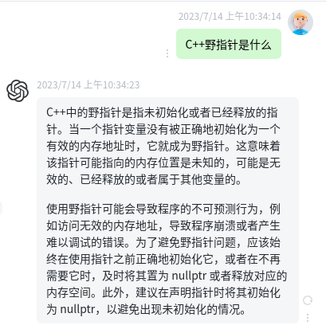

**学习路径:**

C++ →点云 → 优化问题 → 激光slam → 项目 → 简历

其他:自动化脚本(wechat,webcore) 网站 docker  gpt

**什么是野指针?产生情况**

> free null 过程中 未对ptr赋值为null,导致指向的数据不对
>
> 未初始化Ptr

**什么叫内存泄露?**

> **程序在使用动态分配内存时，在某些情况下，无法正确释放已经分配的内存，导致内存空间被占用，无法再次使用。随着内存泄漏的持续发生，最终会导致系统崩溃或者出现严重的性能问题。**

**单目相机的标定?**

**双目相机的标定?**

**激光雷达和相机标定?**

**手眼标定?**(眼在内在外两种情况)

**优化问题**

