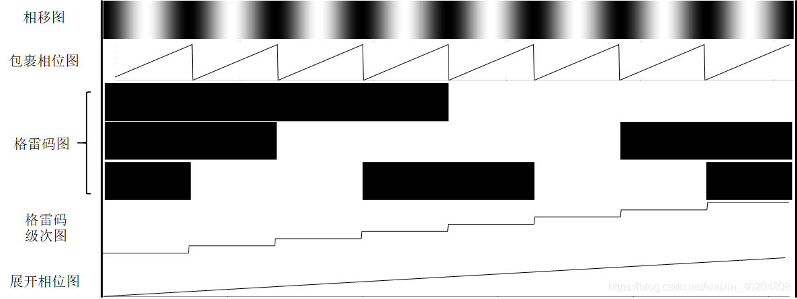
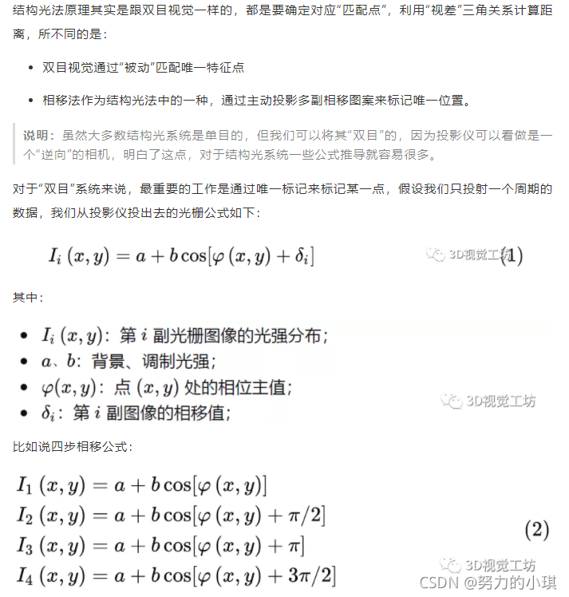

# 【结构光三维重建】

参考:

[**1.基于格雷码的相位展开方法(含代码)**](https://blog.csdn.net/weixin_40204808/article/details/117259473)

[**2.结构光格雷码编码解码二值化 相移**](https://blog.csdn.net/qq_45484797/article/details/120726141)

