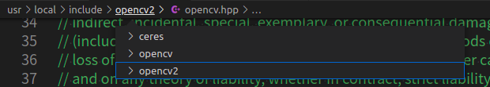
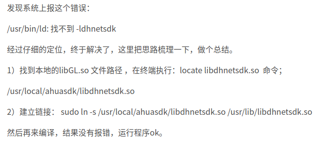
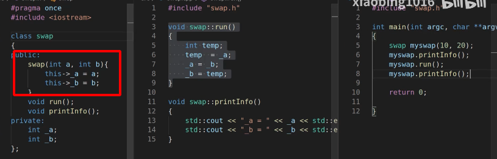

### 前置基础：

**`编译：`**


```
一、编译过程： 
1）预处理，生成.i文件 
2）转换成为汇编语言，生成.s文件 
3）汇编变为目标代码（机器代码），生成.o文件 
4）链接目标代码，生成可执行程序。  
```

**[g++/gcc命令理解](https://www.jianshu.com/p/33126d6baa3c)**

[**g++编译总结**](https://www.cnblogs.com/bugutian/p/4490902.html)

[**g++使用总结**](https://www.cnblogs.com/chenwx-jay/p/gcc.html)

g++常用命令：

-c 生成.o目标文件

-o可执行文件命名

-shared 指定生成动态链接库

-static 指定生成静态链接库

-L 要链接的库所在目录

-l 指定链接时需要的动态库，隐含命名规则，即在前加lib，在后加.a或.so确定库文件名


**`调试：`**

Ctrl x ctrl a 进入调试

.jpeg)

-16332321203091.jpeg)

输入命令info break,可以查看当前已经设置的断点

### 开发疑问：

* ==定义 实现== -==声明 引用==   的深度理解？
* g++的用法和gcc类似，编译C++的时候比gcc更简单，因为它会自动链接到C++标准库，而不像gcc需要手工指定。
  g++ main.cpp -o main
  g++ testspeaker.cpp speaker.cpp -o testspeaker
* 关于头文件

  - **[#include 是什么意思？](https://zhidao.baidu.com/question/151006287.html)**直白的说，它就是告诉你，在这个地方，你要插入一堆代码，这堆代码在另一个文件里。

  * .h 让各个分开的文件结合起来编辑  可以声明多次 但不能定义多次  （错误认识）
  * 头文件<>    ""[**区别**]()
  * 通俗的说：在C系统的编程语言中，#include是为了声明在这个地方插入别的文件中的代码。

- g++ main.cpp -Icat/  -Llib/  -lcat -o a 编译不过   建立软连接可以编译过
- g++ main.cpp -Icat/  -L/home/admins/桌面/github/Release/lib/  -lcat -o a   编译过了
- 多文件编译时候 不会先编译so 再编译bin？
- 多文件编译不需要包含头文件，cpp包含的的话会自动获取？


### 报错汇总：

> (特别熟练的看明白报错信息) 很重要！！！特别是控制台的报错提醒

1. 未声明 

   ```
   ../../src/aktof.cc:940:9: 错误： ‘queue’在此作用域中尚未声明
            queue<cv::Point> checkList;
            ^~~~~
   ../../src/aktof.cc:940:24: 错误： expected primary-expression before ‘>’ token
            queue<cv::Point> checkList;
                           ^
   ../../src/aktof.cc:940:26: 错误： ‘checkList’在此作用域中尚未声明
            queue<cv::Point> checkList;
   ```

   reason：头文件没有导入

   clear && sh build_aarch64_rk3326.sh  ：如果报错很多 看第一个错误和清空屏幕 不然影响判断

2. 定义了没实现

   ```shell
   ：/tmp/ccIji8Yp.o：在函数‘main’中：
   main.cpp:(.text+0x48)：对‘person::person()’未定义的引用
   main.cpp:(.text+0x54)：对‘person::say()’未定义的引用
   main.cpp:(.text+0x60)：对‘person::~person()’未定义的引用
   main.cpp:(.text+0x85)：对‘person::~person()’未定义的引用
   collect2: error: ld returned 1 exit status
   ```

3. 重复定义/重复实现

   ```shell
   ./src/person.cpp:4:7: error: redefinition of ‘class person’
    class person
          ^~~~~~
   In file included from ./src/person.cpp:2:0,
                    from main.cpp:4:
   ./src/../include/person.h:2:7: note: previous definition of ‘class person’
    class person
          ^~~~~~  
   ```
   **[\#pragma once](https://www.cnblogs.com/qiang-upc/p/11407364.html)**  能解决部分问题（只能处理同一个文件的定义被多次include的问题）

4. 源文件没找到

   

   

   

   ```
   /home/admins/桌面/ak-wire-detector/include/stdafx.h:19:23: 致命错误： Eigen/Dense：没有那个文件或目录
    #include <Eigen/Dense>
   ```

   解决思路：在交叉工具链查看有没有eigen 有的话就看头文件写的格式是不是搜索的到的路径

5. 重复声明

   ```shell
   main.cpp: In function ‘int main()’:
   main.cpp:15:9: error: redeclaration of ‘person glider’
     person glider;
            ^~~~~~
   main.cpp:14:9: note: ‘person glider’ previously declared here
     person glider;
   ```


cmake报错：

没有编译完成，动态库没找到


常见错误：/usr/bin/ld: 找不到 -lcat

分析：

- 首先知道出错在那个阶段：链接库阶段
- 是否存在该库：find、locate
  - 没有：下载或者自己编译
  - 有：此目录权限不够 开启搜索权限   或者把库移到共享库/usr/lib /usr/local/lib和软连接






### 总结：

1.吧一个程序看做是一个文件编译的

2.报错出在那个阶段   

3.头文件的次序 和写法
