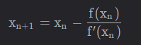

## optimization_learn

优化本质就是求极值,就需要倒数

理解路线:

**[一维(单自变量)情况:](https://blog.csdn.net/bitcarmanlee/article/details/121501106?spm=1001.2101.3001.6650.3&utm_medium=distribute.pc_relevant.none-task-blog-2%7Edefault%7EBlogCommendFromBaidu%7ERate-3-121501106-blog-97242815.235%5Ev38%5Epc_relevant_anti_t3_base&depth_1-utm_source=distribute.pc_relevant.none-task-blog-2%7Edefault%7EBlogCommendFromBaidu%7ERate-3-121501106-blog-97242815.235%5Ev38%5Epc_relevant_anti_t3_base&utm_relevant_index=4)**

- 泰勒展开公式  :泰勒公式是将一个在x=x0处具有n阶导数的函数f（x）利用关于（x-x0）的n次多项式来逼近函数的方法 		    
 
 -  一阶微分(梯度下降)  
  
   ​	
  
 -  二阶微分(牛顿法)      
  
 

