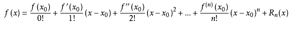
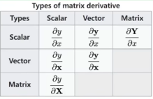
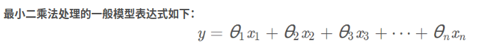
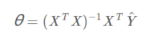
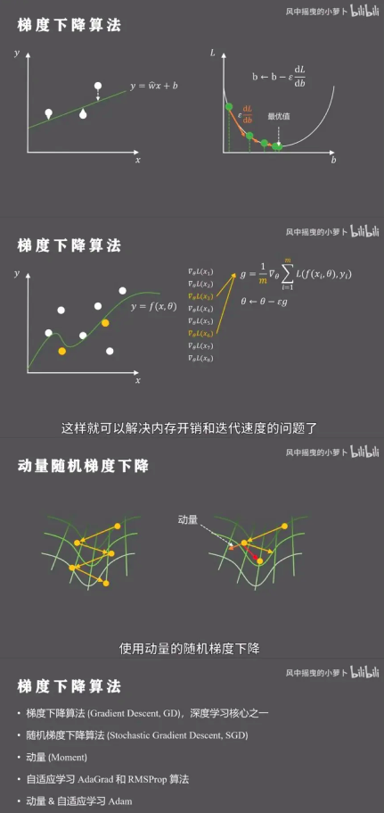
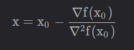
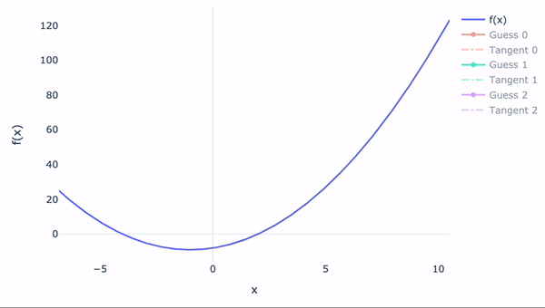
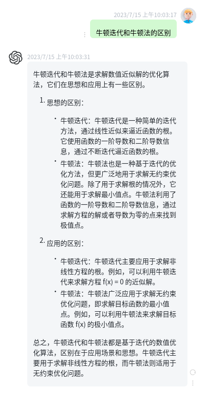
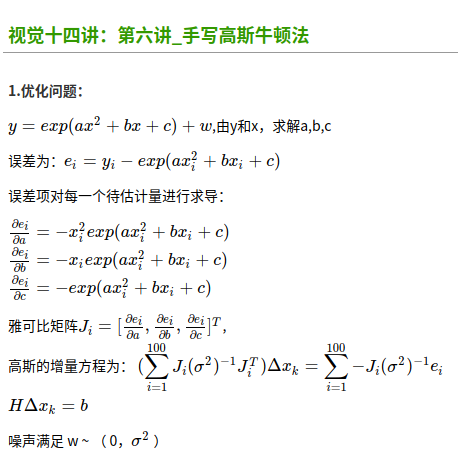
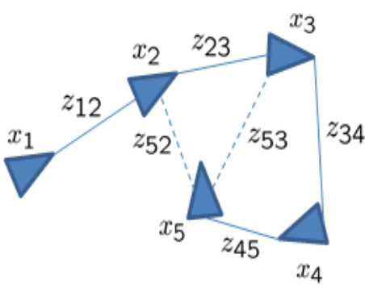

## optimization_learn

<table>
    <tr>
        <td bgcolor=#FF00FF>3要素:优化什么?代价函数?约束项?</td>		</tr>
</table>
<table>

**0.一些基础前置概念:**

- 泰勒展开公式  :泰勒公式是将一个在x=x0处具有n阶导数的函数f（x）利用关于（x-x0）的n次多项式来逼近函数的方法 		    

- 最优化和根的问题是两个问题;

- 求导过程维度问题:

  

[**1.最小二乘法**:](https://blog.csdn.net/W1995S/article/details/118153146?spm=1001.2014.3001.5506)

可以拟合直线,也就是线性项,也可以拟合曲线,高阶项,记住,关于优化的系数依旧是线性的θx = y;

​																																

不仅可以求多项式的形式的解析解 例如:y=a0 + a1x +a2x^2 +a3x^ + .... 

也可求y = e(ax^2 + x)  

以为优化的是系数,是求关于系数的线性表达式

**2.梯度下降算法**(一阶)

**3.牛顿下降算法**(二阶)

​	

 -  二阶微分(牛顿法)                                                             

**4.牛顿迭代**

**4.一些个人理解**

- 优化本质就是求极值,就需要倒数
- 优化函数不是恒等式,是个函数,需要找极值点,而约束是等式?
- 理解概率和似然概念
- 理解求根和求极值
- 协方差是一维标准差在高维的另一种表述
- 求函数极值时候为啥不能直接求导?   在多维矩阵中很复杂,一般通过迭代方式求出;
- 
- 

**高斯牛顿**

**ceres关于图优化问题**

　　首先是图的节点，一般为位姿；再者，边代表节点与节点之间的相对变换（旋转和平移），一般是真实测量的数据，如里程计、激光雷达数据、imu数据等。如下图，三角形代表位姿、边代表测量数据；虚线代表回环检测的约束边。

**参考:**

- **[各类优化算法区别](https://blog.csdn.net/bitcarmanlee/article/details/121501106?spm=1001.2101.3001.6650.3&utm_medium=distribute.pc_relevant.none-task-blog-2%7Edefault%7EBlogCommendFromBaidu%7ERate-3-121501106-blog-97242815.235%5Ev38%5Epc_relevant_anti_t3_base&depth_1-utm_source=distribute.pc_relevant.none-task-blog-2%7Edefault%7EBlogCommendFromBaidu%7ERate-3-121501106-blog-97242815.235%5Ev38%5Epc_relevant_anti_t3_base&utm_relevant_index=4)**
- **[视觉14讲(系统)优化部分](https://www.bilibili.com/video/BV1V3411d7P9/?spm_id_from=333.880.my_history.page.click&vd_source=7f98e46af73470a39ad6b1a64611b176)**
- [**高翔图优化**](https://blog.csdn.net/qq_43478017/article/details/116065170)

