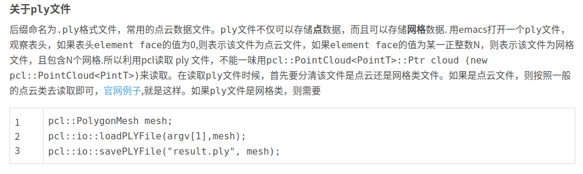

1.文件格式

.pcd

.stl

.ply

.mesh

.obj

.las  

LAS格式是一种二进制文件格式。其目的是提供一种开放的格式标准,允许不同的硬件和软件提供商输出可互操作的统一格式。现在LAS格式文件已成为LiDAR数据的工业标准格式.LAS文件按每条扫描线排列方式存放数据,包括激光点的三维坐标、多次回波信息、强度信息、扫描角度、分类信息、飞行航带信息、飞行姿态信息、项目信息、GPS信息、数据点颜色信息等

