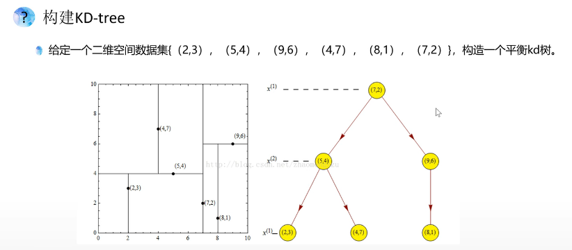
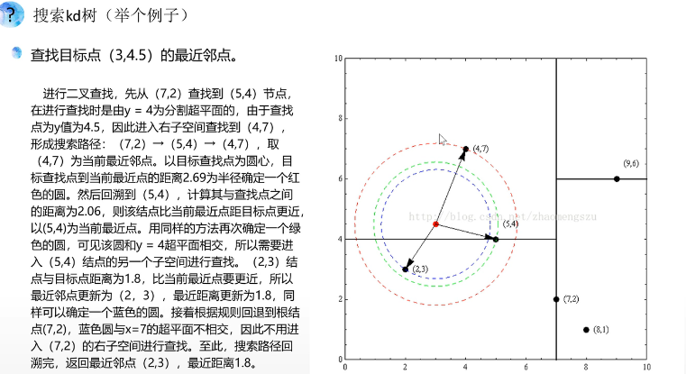

**二叉树**

最小二乘拟合，旨在照顾所有人的想法，对所有数据进行拟合，在无效数据多且偏移量大的情况下，拟合效果不好。
而RANSAC拟合，旨在照顾多数人的意愿，对主体数据进行拟合，手动设置一个阈值，同拟合平面的距离超过阈值的点，就被判定为无效数据。
随机拟合多个平面，选取平面内数据点最多的平面，或者说，无效数据最少的平面，作为拟合出的结果。

  

  `pcl::copyPointCloud(*cloud, inliers, *final);`

