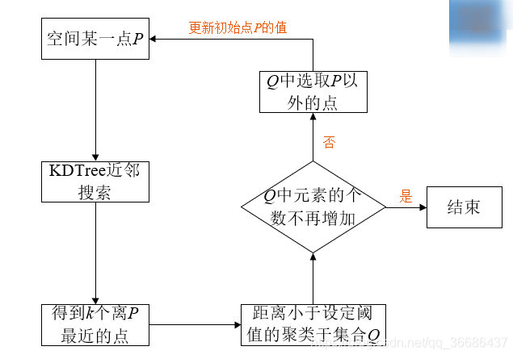
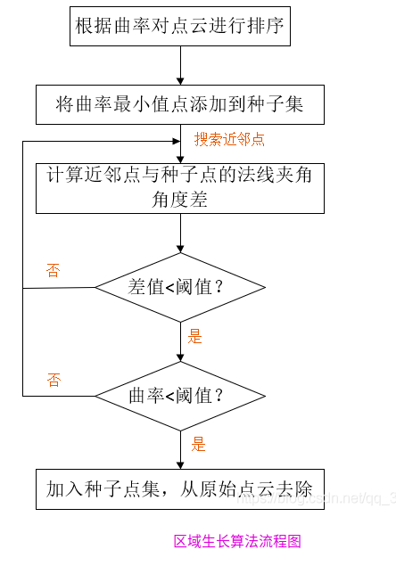
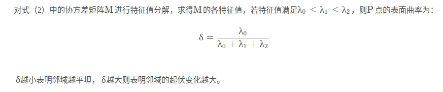

## PCL学习

#### 文件格式

.pcd

.stl

.ply

.mesh

.obj

.las  

LAS格式是一种二进制文件格式。其目的是提供一种开放的格式标准,允许不同的硬件和软件提供商输出可互操作的统一格式。现在LAS格式文件已成为LiDAR数据的工业标准格式.LAS文件按每条扫描线排列方式存放数据,包括激光点的三维坐标、多次回波信息、强度信息、扫描角度、分类信息、飞行航带信息、飞行姿态信息、项目信息、GPS信息、数据点颜色信息等

#### **二叉树**

#### [**octree**](https://blog.csdn.net/m0_37816922/article/details/124792692)

八叉树(octree)是一种空间中的栅格化方法，为了更直观地理解八叉树的思想，可通过其二维形式——四叉树来进行说明。仍以六个数据点作为研究对象：{(2,3), (5,4), (9,6), (4,7), (8,1), (7,2)}，如果以[ 0 , 10 ) [0,10)[0,10)为坐标空间，那么通过对这个空间四等分，可得到下左图

最小二乘拟合，旨在照顾所有人的想法，对所有数据进行拟合，在无效数据多且偏移量大的情况下，拟合效果不好。
而RANSAC拟合，旨在照顾多数人的意愿，对主体数据进行拟合，手动设置一个阈值，同拟合平面的距离超过阈值的点，就被判定为无效数据。
随机拟合多个平面，选取平面内数据点最多的平面，或者说，无效数据最少的平面，作为拟合出的结果。

  

  `pcl::copyPointCloud(*cloud, inliers, *final);`

**欧式距离分割**

**区域生长分割**

**点云特征**

- [ ] 法向量 :PCA分析和最小二乘拟合平面获取

  PCA的协方差矩阵分解的特征值最小值对应的向量就是法向量

- [ ] 曲率

  

